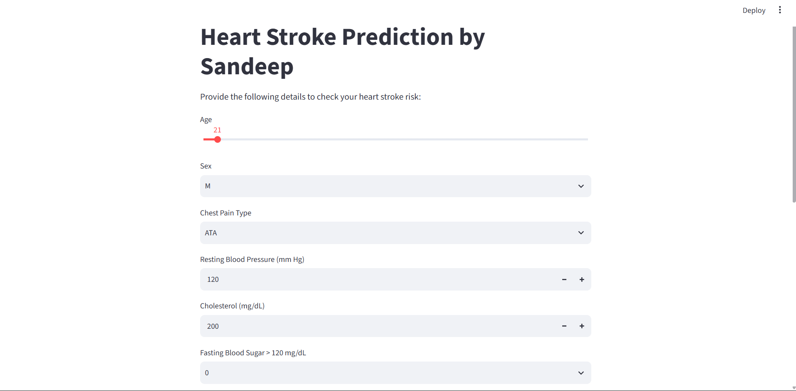
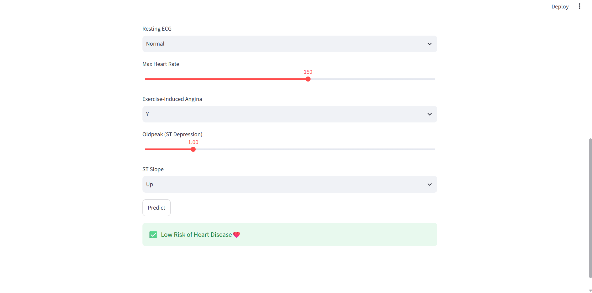

# ❤️ Heart Disease Risk Prediction

An end-to-end **Machine Learning + Streamlit** project that predicts the risk of heart disease from patient health parameters.

The project covers the complete ML workflow:

**Data Exploration → Preprocessing → Encoding → Model Comparison → Scaling → Model Saving → Streamlit Deployment**

> ⚠️ **Disclaimer:** This project is created for educational and demonstration purposes only. It is not a medical diagnostic tool and should not be used as a substitute for professional medical advice.

---

## 🚀 Live Application

The model is deployed as an interactive **Streamlit web application**.

The application allows users to enter patient information through sliders and dropdown menus and receive a predicted heart disease risk.

---

## 📌 Project Overview

The model uses patient-level clinical and physiological information to perform a binary classification:

- **0 → Low Risk / No Heart Disease**
- **1 → High Risk / Heart Disease**

### Input Features

| Feature | Description |
|---|---|
| Age | Patient's age |
| Sex | Patient sex |
| Chest Pain Type | Type of chest pain |
| Resting Blood Pressure | Resting blood pressure in mm Hg |
| Cholesterol | Serum cholesterol in mg/dL |
| Fasting Blood Sugar | Whether fasting blood sugar is greater than 120 mg/dL |
| Resting ECG | Resting electrocardiogram result |
| Max Heart Rate | Maximum heart rate achieved |
| Exercise-Induced Angina | Whether exercise induces angina |
| Oldpeak | ST depression induced by exercise |
| ST Slope | Slope of the peak exercise ST segment |

---

## 🧠 Machine Learning Workflow

### 1. Data Loading & Exploration

The dataset is loaded using Pandas and explored through:

- Dataset shape and structure
- Data types
- Missing-value checks
- Descriptive statistics
- Exploratory Data Analysis (EDA)
- Feature distributions and relationships

The dataset used in the project contains **918 observations and 12 columns**, including the target variable `HeartDisease`.

### 2. Data Preprocessing

Categorical variables are converted into numerical features using **one-hot encoding**.

Examples:

```text
Sex → Sex_M
ChestPainType → ChestPainType_ATA
             → ChestPainType_NAP
             → ChestPainType_TA
RestingECG → RestingECG_Normal
           → RestingECG_ST
ExerciseAngina → ExerciseAngina_Y
ST_Slope → ST_Slope_Flat
         → ST_Slope_Up
```

The target variable is:

```text
HeartDisease
```

### 3. Train-Test Split

The dataset is divided into training and testing sets using:

- **80% Training**
- **20% Testing**
- `stratify=y`
- `random_state=42`

### 4. Feature Scaling

`StandardScaler` is used to standardize the input features before model training.

### 5. Model Comparison

The following classification algorithms were evaluated:

- Logistic Regression
- K-Nearest Neighbors (KNN)
- Gaussian Naive Bayes
- Decision Tree
- Support Vector Machine (RBF Kernel)

### 📊 Model Performance

| Model | Accuracy | F1 Score |
|---|---:|---:|
| Logistic Regression | 87.50% | 88.78% |
| **KNN** | **88.59%** | **89.86%** |
| Naive Bayes | 86.96% | 87.88% |
| Decision Tree | 74.46% | 75.13% |
| SVM (RBF Kernel) | 86.41% | 88.04% |

Based on the evaluated test-set results, **KNN achieved the highest accuracy and F1 score**, so it was selected for the Streamlit application.

---

## 💻 Streamlit Application

The Streamlit application provides an interactive interface where users can enter:

- Age
- Sex
- Chest Pain Type
- Resting Blood Pressure
- Cholesterol
- Fasting Blood Sugar
- Resting ECG
- Maximum Heart Rate
- Exercise-Induced Angina
- Oldpeak
- ST Slope

After clicking **Predict**, the application processes the input and displays the predicted risk.

### Application Screenshots

#### 🖥️ Input Interface



#### ✅ Prediction Result



---

## 🔄 How Prediction Works

The Streamlit application loads three saved files:

```text
KNN_heart.pkl
scaler.pkl
columns.pkl
```

### 1. Saved Model

`KNN_heart.pkl` contains the trained KNN classifier.

### 2. Saved Scaler

`scaler.pkl` contains the fitted `StandardScaler`, which ensures that new user inputs are transformed in the same way as the training data.

### 3. Expected Columns

`columns.pkl` stores the feature names used during model training.

This helps the application maintain the same feature structure and order during prediction.

The input is then:

```text
User Input
    ↓
One-Hot Encoded Features
    ↓
Match Training Columns
    ↓
Standard Scaling
    ↓
KNN Model
    ↓
Prediction
    ↓
Low Risk / High Risk
```

---

## 📂 Repository Structure

```text
Heart-Disease-Risk-Prediction/
│
├── Heart.ipynb          # Complete ML workflow and EDA
├── app.py               # Streamlit application
├── heart.csv            # Dataset
├── KNN_heart.pkl        # Trained KNN model
├── scaler.pkl           # Saved StandardScaler
├── columns.pkl          # Training feature columns
├── assets/
│   ├── app_screenshot_1.png
│   └── app_screenshot_2.png
│
└── README.md
```

---

## 🛠️ Technologies Used

- **Python**
- **Pandas**
- **NumPy**
- **Matplotlib**
- **Seaborn**
- **Scikit-learn**
- **Joblib**
- **Streamlit**
- **Jupyter / Google Colab**

---

## ▶️ How to Run Locally

### 1. Clone the repository

```bash
git clone https://github.com/sandeepkr10229/Heart-Disease-Risk-Prediction.git
cd Heart-Disease-Risk-Prediction
```

### 2. Install dependencies

```bash
pip install pandas numpy matplotlib seaborn scikit-learn joblib streamlit
```

### 3. Run the Streamlit application

```bash
streamlit run app.py
```

The application will open in your browser.

---

## 📈 Key Learning Outcomes

This project demonstrates practical understanding of:

- Exploratory Data Analysis
- Categorical feature encoding
- Train-test splitting
- Feature scaling
- Classification algorithms
- Model evaluation using Accuracy and F1 Score
- Saving trained ML models using Joblib
- Building an interactive ML application using Streamlit
- Connecting a trained ML model with a frontend interface
- Deploying an ML project for real-time prediction

---

## 🔮 Future Improvements

Some possible improvements include:

- Hyperparameter tuning for KNN
- Cross-validation for more robust model evaluation
- Adding confusion matrix and ROC-AUC analysis
- Using a complete preprocessing pipeline
- Adding probability/confidence scores
- Improving UI/UX
- Adding input validation and better error handling
- Deploying the application publicly
- Comparing additional ensemble models

---

## 👨‍💻 Author

**Sandeep Kumar**

GitHub: [@sandeepkr10229](https://github.com/sandeepkr10229)

---

## ⭐ If You Like This Project

Feel free to **star ⭐ the repository**, explore the notebook, and experiment with the Streamlit application.
